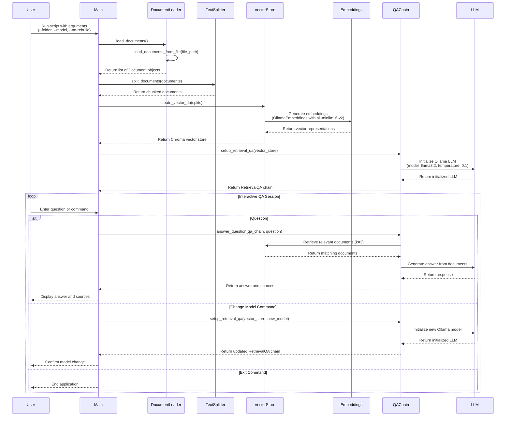

<div align="center">
  <table>
    <tr>
      <td><h1>TP - Local PDF RAG System with langchain, Ollama and ChromaDB 🦜</h1></td>
      <td align="right"></td>
    </tr>
  </table>
</div>


## Overview

Imagine your client is a legal firm handling sensitive cases, needs a way to quickly search through thousands of pages of case documents. 

**They've made it clear that due to confidentiality concerns, they can't use any cloud-based AI solutions - everything must run locally on their secure network.**

Your task for thhis tp is to build a working PDF Retrieval Augmented Generation (RAG) system using local models (Ollama) that can answer questions (on a shell, no neeg GUI) about PDF documents without putting the pdf on a external server. 🚀

## Project structure 

Below the `tree` structure of the project with the `data` repository with the [attention paper](https://arxiv.org/pdf/1706.03762) inside for testing (you can also put other PDFs if you want to explore).  

```
.
├── TP_RAG.md
├── data
│   ├── attention.pdf
│   └── other-test-file.pdf
├── rag_example.py
```


## Sequence flow diagram 




## Implementation Walkthrough 

Some guidelines to guide you through your implementation 🥸

1. manage your environment variables with `dotenv`
2. write the functions according to the sequense flow like : 
   1. `load_documents_from_file(file_path)`
   2. `load_documents()`
   3. `split_documents(documents)`
   4. `create_vector_db(splits)`
   5. `load_vector_db()`
   6. `setup_retrieval_qa(vector_store, model_name=None)`
   7. `ingest_all_pdfs(rebuild_db=True)` 
   8. `get_format_instructions`
   9. `answer_question_structured`
3. use `argparse` module in order to : 
   1. parses the following arguments:
      1. `--folder` is set to ./my_pdfs
      2. `--model` is set to llama3.2
      3. `--no-rebuild` is set to True
   2. the script updates the global variables:
      1. `PDF_FOLDER = "./my_pdfs"`
      2. `OLLAMA_MODEL = "llama3.2"`
      3. `rebuild_db = False` (because --no-rebuild was provided).
            

In addition you will structured the output of you llm with the `with_structured_output()` method explain in the langchain official documentation [here](https://python.langchain.com/docs/how_to/structured_output/) 


```python
def load_documents_from_file(file_path):
    """
    Load PDF document from the specified path using PyPDFLoader.

    Args:
        file_path: Path to the PDF file.

    Returns:
        List of Document objects: Loaded PDF pages represented as Langchain Document objects.
    """
    # TODO: Implement this function
    pass


def load_documents():
    """
    Load all PDF documents from the PDF_FOLDER.

    Returns:
        List of Document objects: Loaded PDF pages represented as Langchain Document objects.
    """
    # TODO: Implement this function
    pass

def split_documents(documents):
    """
    Split documents into smaller chunks for better processing.

    Args:
        documents: List of Document objects to split.

    Returns:
        List of Document objects: Split documents.
    """
    # TODO: Implement this function
    pass

def create_vector_db(documents):
    """
    Create a vector database from the documents.

    Args:
        documents: List of Document objects to embed.

    Returns:
        Chroma: Vector store with the embedded documents.
    """
    # TODO: Implement this function
    pass

def load_vector_db():
    """
    Load an existing vector database.

    Returns:
        Chroma: Loaded vector store.
    """
    # TODO: Implement this function
    pass

def setup_retrieval_qa(vector_store, model_name=None):
    """
    Set up a RetrievalQA chain with the given vector store.

    Args:
        vector_store: Vector store to use for retrieval.
        model_name: Optional model name to use, defaults to global OLLAMA_MODEL

    Returns:
        RetrievalQA: QA chain for question answering.
    """
    # TODO: Implement this function
    pass

def answer_question(qa_chain, question):
    """
    Answer a question using the QA chain.

    Args:
        qa_chain: QA chain to use.
        question: Question to answer.

    Returns:
        dict: Answer and source documents.
    """
    # TODO: Implement this function
    pass

def ingest_all_pdfs(rebuild_db=True):
    """
    Ingest all PDFs from the PDF_FOLDER into the vector database.
    
    Args:
        rebuild_db: Whether to rebuild the database even if it exists.
        
    Returns:
        Chroma: The vector store with the ingested documents.
    """
    # TODO: Implement this function
    pass


def answer_question_structured(qa_chain, question, parser):
    """
    Answer a question using the QA chain and parse the result.

    Args:
        qa_chain: QA chain to use.
        question: Question to answer.
        parser: Pydantic parser to use for extracting structured data.

    Returns:
        dict: Structured answer with citations.
    """
    # TODO: Implement this function
    pass


def get_format_instructions():
    """
    Generate format instructions for the structured output.
    This is a workaround for compatibility with different Pydantic versions.
    
    Returns:
        str: Formatting instructions for the LLM
    """
    schema = {
        "properties": {
            "answer": {
                "title": "Answer",
                "description": "The comprehensive answer to the question",
                "type": "string"
            },
            "reasoning": {
                "title": "Reasoning",
                "description": "The reasoning process used to arrive at the answer",
                "type": "string"
            },
            "citations": {
                "title": "Citations",
                "description": "Citations from the source documents that support the answer",
                "type": "array",
                "items": {
                    "title": "Citation",
                    "description": "Citation for a piece of information from the source documents",
                    "type": "object",
                    "properties": {
                        "page": {
                            "title": "Page",
                            "description": "The page number where this information is found",
                            "type": "integer"
                        },
                        "text": {
                            "title": "Text",
                            "description": "The relevant text snippet that supports the answer",
                            "type": "string"
                        }
                    },
                    "required": ["page", "text"]
                }
            },
            "confidence": {
                "title": "Confidence",
                "description": "Confidence score from 1-10, with 10 being most confident based on document evidence",
                "type": "integer"
            }
        },
        "required": ["answer", "reasoning", "citations", "confidence"],
        "title": "StructuredAnswer",
        "description": "Structured answer to a question with citations"
    }

def main():
    """
    Main function to run the PDF RAG system.
    """
    # Using globals vars to track the current model
    global OLLAMA_MODEL
    
    # TODO: Implement this function

if __name__ == "__main__":
    # Call parse args and run main 
    import argparse
    main()
```

## Output expected 

### Without structure 

You will be asking to the LLM the folowing question : 

`explain me attention in detail with maths formulas in latex notation please`

You will except the expected response : 

```bash
Loading documents...
Loaded 15 documents.
Splitting documents...
Split into 49 chunks.
Creating vector database...

===== PDF RAG System Ready =====
Using Ollama model: llama3.2
Using embedding model: all-minilm:l6-v2
Type 'exit' to quit
Type 'change model:{model_name}' to change the Ollama model

Enter your question: explain maths behind attention in latex notation 

Answer:
Here's an explanation of the math behind Scaled Dot-Product Attention and Multi-Head Attention in LaTeX notation:

**Scaled Dot-Product Attention**

Let $Q$, $K$, and $V$ be three matrices with dimensions $(n, d_k)$, $(n, d_k)$, and $(n, d_v)$ respectively, where $d_k$ and $d_v$ are the number of attention heads.

The attention function is computed as:

$$\text{Attention}(Q, K, V) = \frac{\text{softmax}\left(QK^T/\sqrt{d_k}\right)V}{\sum_{i=1}^{n} QK_i^T/\sqrt{d_k}}$$

where $Q_i$ and $K_i$ are the $i$-th row of $Q$ and $K$, respectively.

The softmax function is applied element-wise to the output of the scaled dot product, resulting in a matrix with dimensions $(n, d_v)$.

**Multi-Head Attention**

In Multi-Head Attention, we apply the attention function to multiple attention heads in parallel. Let $h$ be the number of attention heads.

We first project the queries, keys, and values using linear transformations:

$$Q' = W_Q Q$$
$$K' = W_K K$$
$$V' = W_V V$$

where $W_Q$, $W_K$, and $W_V$ are learnable weight matrices with dimensions $(d_k, d_h)$, $(d_k, d_h)$, and $(d_v, d_h)$ respectively.

We then apply the attention function to each attention head in parallel:

$$\text{Attention}(Q', K', V') = \sum_{i=1}^{h} \frac{\text{softmax}\left(Q_i'K_i^T/\sqrt{d_k}\right)V_i'/\sqrt{d_v}}{\sum_{j=1}^{n} Q_i'K_j^T/\sqrt{d_k}}$$

where $Q_i'$ and $K_i'$ are the $i$-th row of $Q'$ and $K'$, respectively.

The output of Multi-Head Attention is a matrix with dimensions $(n, d_v)$, where each element is a weighted sum of the elements in the corresponding attention head.

Sources:
Source 1:
Page: 3
Content: Scaled Dot-Product Attention
 Multi-Head Attention
Figure 2: (left) Scaled Dot-Product Attention. (right) Multi-Head Attention consists of several
attention layers running in parallel.
of the values, ...

Source 2:
Page: 3
Content: extremely small gradients 4. To counteract this effect, we scale the dot products by 1√dk
.
3.2.2 Multi-Head Attention
Instead of performing a single attention function with dmodel-dimensional keys, v...

Source 3:
Page: 1
Content: aligned RNNs or convolution. In the following sections, we will describe the Transformer, motivate
self-attention and discuss its advantages over models such as [17, 18] and [9].
3 Model Architecture
...
```

### Structured output 


You will be asking to the LLM the folowing question : 

`explain me attention`


```bash
Using PDF folder: ../data/
Loading documents...
Found 2 PDF files in ../data/
Loaded 40 pages from ch3.pdf
Loaded 15 pages from attention.pdf
Loaded 55 total pages from all PDFs.
Splitting documents...
Split into 49 chunks.
Removing existing database...
Creating vector database...
Vector database created successfully.
Setting up structured QA chain...

===== PDF RAG System Ready (Structured Output) =====
Using Ollama model: llama3.2
Using embedding model: all-minilm:l6-v2
Type 'exit' to quit
Type 'change model:{model_name}' to change the Ollama model
Type 'export:{filename}' to export the last answer to a JSON file

Enter your question: explain attention
Error parsing result: 4 validation errors for StructuredAnswer
answer
  field required (type=value_error.missing)
reasoning
  field required (type=value_error.missing)
citations
  field required (type=value_error.missing)
confidence
  field required (type=value_error.missing)
Falling back to raw output...

Answer:
{
  "properties": {
    "answer": {
      "title": "Attention in Transformer Model",
      "description": "Attention is a mechanism that allows different positions of a single sequence to compute a representation of the sequence.",
      "type": "string"
    },
    "reasoning": {
      "title": "Reasoning Process",
      "description": "The Transformer model uses attention mechanisms to allow each position in the decoder to attend over all positions in the input sequence, mimicking typical encoder-decoder attention mechanisms. Self-attention layers in both the encoder and decoder allow each position to attend to all positions in the previous layer.",
      "type": "string"
    },
    "citations": [
      {
        "page": 38,
        "text": "The Transformer model relies entirely on self-attention to compute representations of its input and output without using sequence-aligned RNNs or convolution."
      },
      {
        "page": 2,
        "text": "Self-attention has been used successfully in a variety of tasks including reading comprehension, abstractive summarization, textual entailment, and learning task-independent sentence representations."
      },
      {
        "page": 9,
        "text": "End-to-end memory networks are based on a recurrent attention mechanism instead of sequence-aligned recurrence and have been shown to perform well on simple-language question answering and language modeling tasks."
      }
    ],
    "confidence": 10
  },
  "required": [
    "answer",
    "reasoning",
    "citations",
    "confidence"
  ],
  "title": "StructuredAnswer"
}

Sources:
Source 1:
  Page: 4
  Content: • In "encoder-decoder attention" layers, the queries come from the previous decoder layer,
and the memory keys and values come from the output of the encoder. This allows every
position in the decoder...
Source 2:
  Page: 3
  Content: Scaled Dot-Product Attention
 Multi-Head Attention
Figure 2: (left) Scaled Dot-Product Attention. (right) Multi-Head Attention consists of several
attention layers running in parallel.
of the values, ...
Source 3:
  Page: 1
  Content: described in section 3.2.
Self-attention, sometimes called intra-attention is an attention mechanism relating different positions
of a single sequence in order to compute a representation of the seque...
```

You can improve the structured response by changing the model with a better model type openai/anthropic according to you needs ... 🤗 


